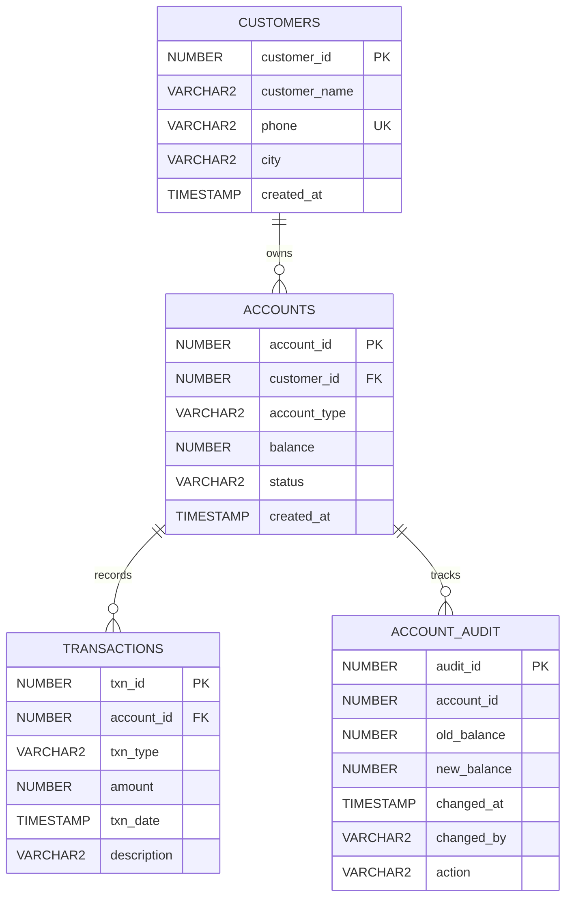

# Database ER Diagram

The banking system uses four main tables. A customer can own multiple accounts, each account can have multiple transactions, and balance changes are recorded in the audit table.

## Relationships

- `CUSTOMERS.customer_id` → `ACCOUNTS.customer_id`
- `ACCOUNTS.account_id` → `TRANSACTIONS.account_id`
- `ACCOUNT_AUDIT.account_id` identifies the account whose balance changed.

## Notes

`ACCOUNT_AUDIT` intentionally keeps historical balance-change records independently from the main account workflow. The current project does not delete accounts, so audit history is retained for reporting.
